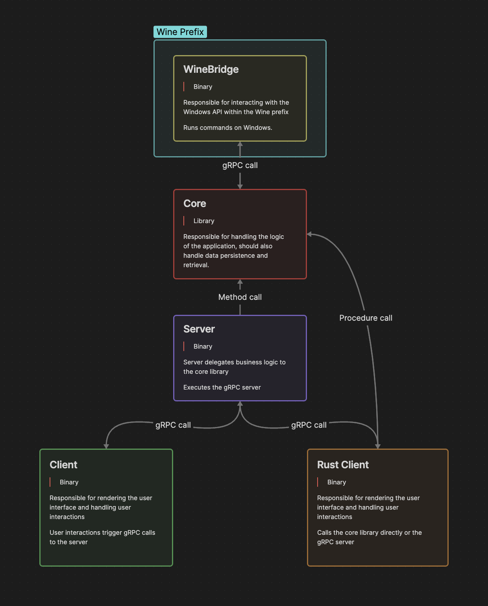

Bottles is a project that aims to run Windows applications on Linux and macOS using Wine.

This document is an overview of the architecture of the project and how the components interact with each other, it aims to lower the entry barrier for new contributors and help them understand the project's structure.

## Components
We decided to split the project into multiple components to make it easier to maintain and develop new features, each component has a specific role and interacts with other components to achieve the project's goal.

- **Client(s)**: Responsible for rendering the user interface and handling user interactions.
- **Server**: Responsible for handling requests from the client.
- **Core**: Responsible for handling the logic of the application.
- **WineBridge**: Responsible for interacting with the Windows API within the Wine prefix.

# Overview
The following diagram shows the main components of the project and how they interact with each other.

Every component in this project is written in Rust, except for the Client, which can be written in any language that has [gRPC support](https://grpc.io/docs/languages/)
## Client
The client is a desktop application. The client communicates with the server using [gRPC](https://grpc.io/) calls.

If the client is written in Rust, the option to call the `core` library directly is available.

## Server
The server is a [gRPC](https://grpc.io/) server that handles requests from the client.

The server talks to WineBridge to interact with the Windows API.

- Uses gRPC for communication between the client and the server.
- Uses Tonic as a gRPC framework.

## Core
The core is a library that contains the logic of the application. The core is used by the server to handle requests from the client.

## WineBridge
WineBridge is a server that runs within the Wine prefix and interacts with the Windows API.
It listens for requests from the server via [Named Pipes](https://learn.microsoft.com/en-us/windows/win32/ipc/named-pipes) and forwards them to the corresponding Windows API calls.

- Uses [windows-rs](https://crates.io/crates/windows) to interact with the Windows API.
## Data Flow
The data flow between components follows this pattern:

1. **Client → Server**: User interactions trigger gRPC calls to the server, if the client is written in Rust it can call the core library directly.
2. **Server → Core**: Server delegates business logic to the core library, which should also handle data persistence and retrieval
3. **Server → WineBridge**: For Windows API operations, server communicates with WineBridge via gRPC calls.
4. **WineBridge → Windows API**: WineBridge translates gRPC requests to Windows API calls within the Wine prefix

Results flow back through the same chain to update the client UI
## Storage & Persistence
The application uses local file-based storage for:

- **Configuration**: Application settings, user preferences, and global configuration
- **Bottle Metadata**: Information about each Wine bottle (name, version, installed applications, etc.)
- **Application Data**: Logs, cache, and temporary files
- **Wine Prefixes**: The actual Wine bottle directories containing Windows environments

Storage is handled through the Core component, which provides a unified interface for data persistence across the application.

## Dependencies & Technology Choices

### Core Dependencies
- **[Tonic](https://crates.io/crates/tonic)**: Chosen as the gRPC framework for Rust due to its excellent performance, async support, and seamless integration with the Rust ecosystem. It provides type-safe gRPC client and server implementations.

- **[windows-rs](https://crates.io/crates/windows)**: Microsoft's official Rust bindings for Windows APIs. This provides direct, safe access to Windows APIs within the Wine environment, ensuring compatibility and reducing the need for custom FFI bindings.

### Communication Protocols
- **gRPC**: Selected for Client-Server communication because it provides:
  - Type-safe API definitions through Protocol Buffers
  - Efficient binary serialization
  - Built-in support for streaming and bidirectional communication
  - Cross-language compatibility for different client implementations

### Storage
- **Local File System**: Used for persistence because it provides:
  - No external database dependencies required
  - Simple deployment and maintenance
  - Direct integration with Wine prefix management
  - Suitable for desktop application use cases
